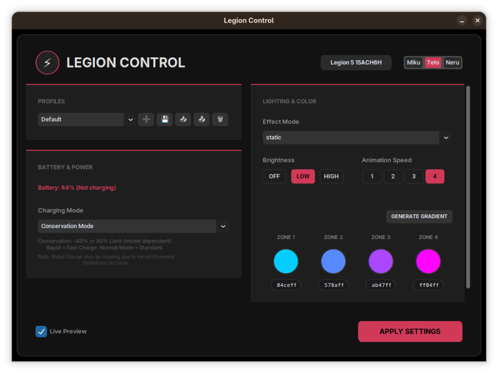

# Legion Controller

A graphical user interface for controlling keyboard RGB lighting and power modes (Conservation/Rapid Charge) on Lenovo Legion laptops. This application is designed specifically for **4-zone RGB models** and is optimized for **Gnome on Wayland**.



## Features
- **RGB Lighting Controls**:
    - **Hardware Modes**: Static, Breath, Wave, and Hue effects.
    - **Software-Driven Patterns**: interactive patterns powered by the app, including **Police Strobe**, **Scanner**, **Heartbeat**, **Fire Flicker**, and **Soft Wave**.
    - **Battery Insight Mode**: A real-time battery gauge that uses the 4 keyboard zones (0-25% Red Zone 1, 26-50% Yellow-Gold Zones 1-2, up to All Green for full charge). Features a subtle pulsating animation to indicate active tracking.
    - **Gradient Generator**: Automatically calculate smooth transitions (Zones 2 & 3) by simply selecting your desired start color in **Zone 1** and end color in **Zone 4**.
- **Power Management**: Toggle Conservation Mode (~60% or 80% limit based on model) and Rapid Charge. *(Note: Rapid Charge is currently non-functional on many models as the sysfs files cannot be located).*
- **System Dashboard**: View hardware specs (CPU, GPU, RAM) and detailed battery health (Wh capacity, cycle health, and real-time wattage discharge).
- **Profiles**: Save and switch between custom lighting setups.
- **Themed UI**: Dark-mode interface with Miku/Teto/Neru color themes, featuring dynamic high-contrast text for perfect readability on all accent colors.

> [!IMPORTANT]
> **Rapid Charge Note**: This feature currently may not work correctly or appear in the UI because the required kernel/firmware files (`rapid_charge`) are often missing or relocated on Linux systems. **Conservation Mode** (~60% or 80% limit depending on model) and **Normal Charging** remain fully functional.

---

## 1. Prerequisites & Dependencies

This app uses `pyusb` to talk to the keyboard controller and `customtkinter` for the interface.

### Install System Requirements
```bash
# Ubuntu/Debian/Fedora
pip install pyusb customtkinter Pillow
```

### Enable Unprivileged Usage (USB Rules)
By default, Linux requires root to access USB devices. Create a udev rule to run the controller without `sudo`:

1. Check your Keyboard Controller ID:
   ```bash
   lsusb | grep -i "Integrated Technology Express"
   ```
   *Usually, it is `048d:c965` or `048d:c995`.*

2. Create the rule file:
   ```bash
   sudo nano /etc/udev/rules.d/99-kblight.rules
   ```

3. Paste the following (replace `c965` with your ID if different):
   ```text
   SUBSYSTEM=="usb", ATTR{idVendor}=="048d", ATTR{idProduct}=="c965", MODE="0666"
   ```

4. Reload rules:
   ```bash
   sudo udevadm control --reload-rules && sudo udevadm trigger
   ```


---

## 2. Installation & Organization

Note: It is suggested to keep the application in your `Documents` folder to ensure consistent file paths.

```bash
# Clone the repository
git clone https://github.com/Eagle10021/Legion-Controller.git

# Move it to your Documents folder
mv Legion-Controller ~/Documents/
cd ~/Documents/Legion-Controller
```

### 2a. Configure Hardware IDs
Open `Legion_KBLight.py` and ensure the `VENDOR` and `PRODUCT` IDs match your `lsusb` output (around lines 56-57). If your product ID was different (e.g. `c995`), change the `0xC965` value:

```python
class LedController:
    VENDOR = 0x048D
    PRODUCT = 0xC965  # Replace with your Product ID
```

---

## 3. Desktop Entry (Application Menu Icon)

To see the app in your Gnome application drawer, you need to create a `.desktop` file.

1. Create the file:
   ```bash
   nano ~/.local/share/applications/legion-controller.desktop
   ```

2. Paste and customize the following template:
   *Note: If you moved the folder to a different location, update the `/home/eagle/Documents/Legion-Controller/...` paths below to match your **actual username** and folder path.*

```ini
[Desktop Entry]
Type=Application
Name=Legion Controller
Comment=Keyboard RGB and Charging controller for Legion laptops
# Replace 'eagle' with your actual username and verify the path!
Exec=python3 /home/eagle/Documents/Legion-Controller/Legion_KBLight.py
Icon=/home/eagle/Documents/Legion-Controller/images/Senko_Loaf.jpg
Terminal=false
Categories=Utility;Settings;
StartupWMClass=legioncontrol
```

3. Save and Exit. 

4. **Log out and log back in** for the application icon to appear in your dashboard and for the `udev` rules to take full effect.

---

## Technical Credits

- **Backend Logic**: This project is built upon the excellent lighting control reverse-engineering work done in [l5p-kbl-2024-Gen9](https://github.com/Drakanio/l5p-kbl-2024-Gen9/tree/main) by Drakanio and the original [l5p-kbl](https://github.com/imShara/l5p-kbl) by imShara.
- **Icon**: [Senko Loaf](https://knowyourmeme.com/memes/senko-loaf) (`Senko_Loaf.jpg`)
